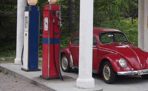
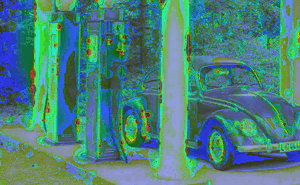

# FovVideoVDP: A visible difference predictor for wide field-of-view video

</img>

FovVideoVDP is a full-reference visual quality metric that predicts the perceptual difference between pairs of images and videos. Similar to popular metrics like PSNR and SSIM, it is aimed at comparing a ground truth reference video against a distorted (e.g. compressed, lower framerate) version.

However, unlike traditional quality metrics, FovVideoVDP works for videos in addition to images, and accounts for peripheral acuity. We model the response of the human visual system to changes over time as well as across the visual field, so we can predict temporal artifacts like flicker and judder, as well as spatiotemporal artifacts as perceived at different degrees of peripheral vision. Such a metric is important for head-mounted displays as it accounts for both the dynamic content, as well as the large field of view.

FovVideoVDP currently has both a Pytorch and MATLAB implementation. The usage is described below.

The details of the metric can be found in:

Mantiuk, Rafał K., Gyorgy Denes, Alexandre Chapiro, Anton Kaplanyan, Gizem Rufo, Romain Bachy, Trisha Lian, and Anjul Patney. 
“FovVideoVDP : A Visible Difference Predictor for Wide Field-of-View Video.” 
ACM Transaction on Graphics, 2021.

Project page: https://github.com/gfxdisp/FovVideoVDP

If you use the metric in your research, please cite the paper above. 

## Predicted quality scores

FovVideoVDP reports image/video quality in the JOD (Just-Objectionable-Difference) units. The highest quality (no difference) is reported as 10 and lower values are reported for distorted content. In case of very strong distortion, or when comparing two unrelated images, the quality value can drop below 0. 

The main advantage of JODs is that they (a) should be linearly related to the perceived amount of distortion and (b) the difference of JODs can be interpreted as the preference prediction across the population. For example, if method A produces a video with the quality score of 8 JOD and method B with the quality score of 9 JOD, it means that 75% of the population will choose method B over A. The plots below show the mapping from the difference between two condition in JOD units to the probability of selecting the condition with the higher JOD score (black numbers on the left) and the percentage increase in preference (blue numbers on the right). For more explanation, please refer to Section 3.9 and Fig. 9 in the main paper.

<table>
  <tr>
    <td>Fine JOD scale</td>
    <td>Coarse JOD scale</td>
  </tr>
  <tr>
    <td></img></td>
    <td></img></td>
  </tr>
</table>

## Usage

## Pytorch

### Requirements
Listed in pytorch/requirements.txt
### Usage
The main script to run the model on a set of images or videos is `fovvvdp_run.py`. Usage:
```
python3 fovvvdp_run.py --help
usage: fovvvdp_run.py [-h] --ref REF --test TEST [TEST ...] [--gpu GPU]
                      [--diff DIFF] [--verbose] [--display DISPLAY]

Evaluate FovVideoVDP on a set of videos

optional arguments:
  -h, --help            show this help message and exit
  --ref REF             ref image or video
  --test TEST [TEST ...]
                        list of test images/videos
  --gpu GPU             select which GPU to use (e.g. 0), default is CPU
  --diff DIFF           type of difference map (None, subthreshold,
                        suprathreshold)
  --verbose             Verbose mode
  --display DISPLAY     display name, e.g. HTC Vive
```
### Examples
##### Downsampling/Upsampling Artifacts

These examples were generated by downsampling (4x4) followed by upsampling (4x4) a video using different combinations of Bicubic and Nearest filters.
<table>
  <tr>
    <td>Bicubic &#8595; Bicubic &#8593; (4x4)</td>
    <td>Bicubic &#8595; Nearest &#8593; (4x4)</td>
    <td>Nearest &#8595; Bicubic &#8593; (4x4)</td>
    <td>Nearest &#8595; Nearest &#8593; (4x4)</td>
  </tr>
  <tr>
    <td></img></td>
    <td></img></td>
    <td></img></td>
    <td></img></td>
  </tr>
</table>

```
python fvvdp_run.py --gpu 0 --ref ../pytorch_examples/aliasing/ferris-ref.mp4 --test ../pytorch_examples/aliasing/ferris-*-*.mp4 --display "sdr_fhd_24" --diff suprathreshold
Running on cuda:0
Mode: Video
Using color space sRGB
..\examples\aliasing\ferris-bicubic-bicubic.mp4...
    SSIM 0.7560 VDP: 6966.1333 (JOD  7.4506)
    Writing diff map...
..\examples\aliasing\ferris-bicubic-nearest.mp4...
    SSIM 0.7058 VDP: 7555.1919 (JOD  7.3241)
    Writing diff map...
..\examples\aliasing\ferris-nearest-bicubic.mp4...
    SSIM 0.7645 VDP: 11463.7666 (JOD  6.5678)
    Writing diff map...
..\examples\aliasing\ferris-nearest-nearest.mp4...
    SSIM 0.7199 VDP: 12042.9697 (JOD  6.4653)
    Writing diff map...
```

##### Different framerates
This example was generated by reducing framerate of a video by 4x.
<table>
  <tr>
    <td>Reference (60 Hz)</td>
    <td>Test (15 Hz)</td>
    <td>Predicted Difference</td>
  </tr>
  <tr>
    <td></img></td>
    <td></img></td>
    <td></img></td>
  </tr>
</table>

```
python fvvdp_run.py --gpu 0 --ref ../pytorch_examples/framerate/ref_60fps.mp4 --test ../pytorch_examples/framerate/ref_15*fps.mp4 --display "sdr_fhd_24" --diff subthreshold
Running on cuda:0
Mode: Video
Using color space sRGB
..\examples\framerate\ref_15fps.mp4...
    Upsampling ref (60.00) and test (15.00) to 60 fps
    SSIM 0.9219 VDP: 1453.5835 (JOD  8.9996)
    Writing diff map...
..\examples\framerate\ref_15_to_60fps.mp4...
    SSIM 0.9208 VDP: 1460.1636 (JOD  8.9969)
    Writing diff map...
```

##### Flickering
This example was generated by adding Gaussian darkening to an image either statically or dynamically.

<table>
  <tr>
    <td>Reference</td>
    <td>Test (Static)</td>
    <td>Test (Dynamic)</td>
  </tr>
  <tr>
    <td></img></td>
    <td></img></td>
    <td></img></td>
  </tr>
  <tr>
    <td></td>
    <td></img></td>
    <td></img></td>
  </tr>
</table>

```
python fvvdp_run.py --gpu 0 --ref ../pytorch_examples/flickering/ref.mp4 --test ../pytorch_examples/flickering/test-*.mp4 --display "sdr_fhd_24" --diff subthreshold
Running on cuda:0
Mode: Video
Using color space sRGB
..\examples\flickering\test-blur-20.mp4...
    SSIM 0.9997 VDP: 972.6393 (JOD  9.2129)
    Writing diff map...
..\examples\flickering\test-flicker-20.mp4...
    SSIM 0.9999 VDP: 2667.1636 (JOD  8.5627)
    Writing diff map...
```
## MATLAB

Matlab code for the metric can be found in `matlab/fvvdp.m`. The full documentation of the metric can be shown by typing `doc fvvdp`.

The best starting point is the examples, which can be found in `matlab/examples`. For example, to measure the quality of a noisy image and display the difference map, you can use the code:

```
I_ref = imread( 'wavy_facade.png' );
I_test_noise = imnoise( I_ref, 'gaussian', 0, 0.001 );

[Q_JOD_noise, diff_map_noise] = fvvdp( I_test_noise, I_ref, 'display_name', 'iphone_12_pro', 'heatmap', 'threshold' );

clf
imshow( diff_map_noise );

```

FovVideoVDP will run the best (fastest) when CUDA is available on your system. When no CUDA is detected, the metric will automatically switch to a much slower CPU execution. 

### Display specification

When running the metric, you should specify the display on which the images are viewed by passing the `display_name` parameter as shown in the example above. The list of display specifications can be found in the JSON file `display_models/display_models.json`. Refer to the JSON file for examples of display specifications. 

Note the the specification in `display_models.json` is for the display and not the image. If you select to use `sdr_4k_30` with the resolution of 3840x2160 for your display and pass a 1920x1080 image, the metric will assume that the image occupies one quarter of that display. 

If you need more flexibility in specifying display geometry (size, fov, viewing distance) and its colorimetry, you can instead pass objects of the classes `fvvdp_display_geometry`, `fvvdp_display_photo_gog` for most SDR displays, and `fvvdp_display_photo_absolute` for HDR displays. You can also create your own subclasses of those classes for custom display specification. 
 
### Low-level interface

`fvvdp` function is the suitable choice for most cases. But if you need to run metric on large datasets, you can use a low-level function `fvvdp_core`. It requires as input an object of the class `fvvdp_video_source`, which supplies the metric with the frames. Refer to the documentation of that class for further details. 

## Differences between Matlab and Pytorch versions

* Both versions are implementation of the same metric, but due to the differences in video loaders, you can expect to see small differences in their predictions, typically up to 0.05 JOD.
* Currently, Pytorch version processes images are 30 frames video, while the Matlab version has a dedicated "image" mode. Pytorch version will be updated to make it identical to Matlab. 
* Pytorch version loads the entire video into a GPU memory and therefore, cannot process very large sequences and may require more memory. Matlab version loads a frame at the time and requires less GPU memory.
* Pytorch version reports also the SSIM score. 

## Checking and reporting the version

The metric may change over time and therefore it is worth noting the version of the metric used to calculate the results. The version of the metric can be checked by calling `fvvdp_version()`. Check `ChangeLog.md` for the list of changes between different versions.

