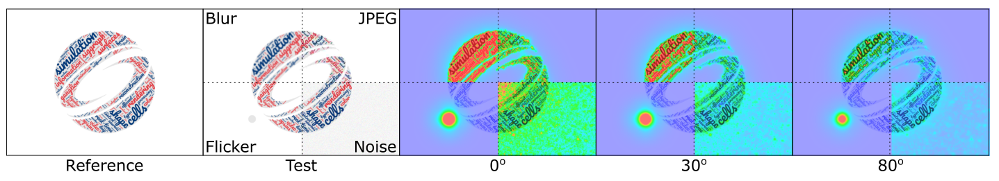
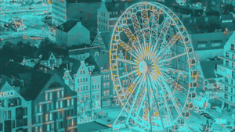
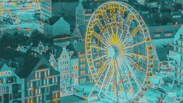
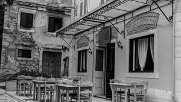
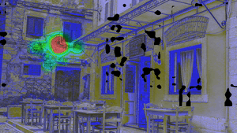
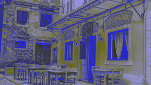

# FovVideoVDP: A visible difference predictor for wide field-of-view video

</img>

FovVideoVDP is a full-reference visual quality metric that predicts the perceptual difference between pairs of images and videos. Similar to popular metrics like PSNR and SSIM, it is aimed at comparing a ground truth reference video against a distorted (e.g. compressed, lower framerate) version.

However, unlike traditional quality metrics, FovVideoVDP works for videos in addition to images, and accounts for peripheral acuity. We model the response of the human visual system to changes over time as well as across the visual field, so we can predict temporal artifacts like flicker and judder, as well as spatiotemporal artifacts as perceived at different degrees of peripheral vision. Such a metric is important for head-mounted displays as it accounts for both the dynamic content, as well as the large field of view.

FovVideoVDP currently has both a Pytorch and MATLAB implementation. The usage is described below.

The details of the metric can be found in:

Mantiuk, Rafał K., Gyorgy Denes, Alexandre Chapiro, Anton Kaplanyan, Gizem Rufo, Romain Bachy, Trisha Lian, and Anjul Patney. “FovVideoVDP : A Visible Difference Predictor for Wide Field-of-View Video.” ACM Transaction on Graphics 40, no. 4 (2021): 49. https://doi.org/10.1145/3450626.3459831.

The paper, videos and additional results have be found at the project web page: https://www.cl.cam.ac.uk/research/rainbow/projects/fovvideovdp/

If you use the metric in your research, please cite the paper above. 

## Display specification

Unlike most image quality metrics, FovVideoVDP needs physical specification of the display (e.g. its size, resolution, peak brightness) and viewing conditions (viewing distance, ambient light) to compute accurate predictions. The specifications of the displays are stored in `fvvdp_data/display_models.json`. You can add the exact specification of your display to this file, however, it is unknown to you, you are encouraged to use one of the standard display specifications listed on the top of that file, for example `standard_4k`, or `standard_fhd`. If you use one of the standard displays, there is a better chance that your results will be comparable with other studies. 

You specify the display by passing `--display` argument to the PyTorch code, or `display_name` parameter to the Matlab code. 

Note the the specification in `display_models.json` is for the display and not the image. If you select to use `standard_hdr` with the resolution of 3840x2160 for your display and pass a 1920x1080 image, the metric will assume that the image occupies one quarter of that display. 

## Reporting metric results

When reporting the results of the metric, please include the string returned by the metric, such as:
`"FovVideoVDP v1.0, 75.4 [pix/deg], Lpeak=200, Lblack=0.5979 [cd/m^2], non-foveated, (standard_4k)"`
This is to ensure that you provide enough details to reproduce your results. 

## Predicted quality scores

FovVideoVDP reports image/video quality in the JOD (Just-Objectionable-Difference) units. The highest quality (no difference) is reported as 10 and lower values are reported for distorted content. In case of very strong distortion, or when comparing two unrelated images, the quality value can drop below 0. 

The main advantage of JODs is that they (a) should be linearly related to the perceived magnitude of the distortion and (b) the difference of JODs can be interpreted as the preference prediction across the population. For example, if method A produces a video with the quality score of 8 JOD and method B gives the quality score of 9 JOD, it means that 75% of the population will choose method B over A. The plots below show the mapping from the difference between two conditions in JOD units to the probability of selecting the condition with the higher JOD score (black numbers on the left) and the percentage increase in preference (blue numbers on the right). For more explanation, please refer to Section 3.9 and Fig. 9 in the main paper.

The differences in JOD scores can be converted to the percentage increase in preference (or the probability selecting A over B) using the matlab function `fvvdp_preference`.

<table>
  <tr>
    <td>Fine JOD scale</td>
    <td>Coarse JOD scale</td>
  </tr>
  <tr>
    <td></img></td>
    <td></img></td>
  </tr>
</table>

## Usage

## Pytorch

### Requirements
Listed in pytorch/requirements.txt
### Usage
The main script to run the model on a set of images or videos is `fovvvdp_run.py`. Usage:
```
python3 fovvvdp_run.py --help
usage: fovvvdp_run.py [-h] --ref REF --test TEST [TEST ...] [--gpu GPU]
                      [--heatmap hm_type] [--verbose] [--display DISPLAY]

Evaluate FovVideoVDP on a set of videos

optional arguments:
  -h, --help            show this help message and exit
  --ref REF             ref image or video
  --test TEST [TEST ...]
                        list of test images/videos
  --gpu GPU             select which GPU to use (e.g. 0 for the first GPU), 
                        default is CPU (no option specified)
  --foveated            pass this option to run the metric in foveated mode
                        the default is non-foveated. The gaze point is fixed
                        to the center of the frame.
  --heatmap hm_type     type of difference heatmap (None, threshold,
                        supra-threshold). The images/video with the heatmaps
                        will be saved in the subfolder "heat_maps" of the folder
                        from which --ref and --test were loaded.
  --verbose             Verbose mode
  --display DISPLAY     display name, e.g. HTC Vive
  --quiet               suppress all output and show only the final JOD value(s)
```
### Examples
##### Downsampling/Upsampling Artifacts

These examples were generated by downsampling (4x4) followed by upsampling (4x4) a video using different combinations of Bicubic and Nearest filters.
<table>
  <tr>
    <td>Bicubic &#8595; Bicubic &#8593; (4x4)</td>
    <td>Bicubic &#8595; Nearest &#8593; (4x4)</td>
    <td>Nearest &#8595; Bicubic &#8593; (4x4)</td>
    <td>Nearest &#8595; Nearest &#8593; (4x4)</td>
  </tr>
  <tr>
    <td></img></td>
    <td></img></td>
    <td></img></td>
    <td></img></td>
  </tr>
</table>

```
python fvvdp_run.py --gpu 0 --ref ../pytorch_examples/aliasing/ferris-ref.mp4 --test ../pytorch_examples/aliasing/ferris-*-*.mp4 --display "sdr_fhd_24" --heatmap supra-threshold
[INFO] Running on device: cuda:0
[INFO] Mode: Video
[INFO] Using color space sRGB
[INFO] When reporting metric results, please include the following information:
[INFO] FovVideoVDP v1.0, 37.8 [pix/deg], Lpeak=100, Lblack=0.4979 [cd/m^2], non-foveated
[INFO] Predicting the quality for ../pytorch_examples/aliasing/ferris-bicubic-bicubic.mp4...
Q_JOD=7.1878
[INFO] Writing heat maps...
[INFO] Predicting the quality for ../pytorch_examples/aliasing/ferris-bicubic-nearest.mp4...
Q_JOD=7.0069
[INFO] Writing heat maps...
[INFO] Predicting the quality for ../pytorch_examples/aliasing/ferris-nearest-bicubic.mp4...
Q_JOD=6.4451
[INFO] Writing heat maps...
[INFO] Predicting the quality for ../pytorch_examples/aliasing/ferris-nearest-nearest.mp4...
Q_JOD=6.3234
[INFO] Writing heat maps...
```

##### Flickering
This example was generated by adding Gaussian darkening to an image either statically or dynamically.

<table>
  <tr>
    <td>Reference</td>
    <td>Test (Static)</td>
    <td>Test (Dynamic)</td>
  </tr>
  <tr>
    <td></img></td>
    <td></img></td>
    <td></img></td>
  </tr>
  <tr>
    <td></td>
    <td></img></td>
    <td></img></td>
  </tr>
</table>

```
python fvvdp_run.py --gpu 0 --ref ../pytorch_examples/flickering/ref.mp4 --test ../pytorch_examples/flickering/test-*.mp4 --display "sdr_fhd_24" --heatmap threshold
[INFO] Running on device: cuda:0
[INFO] Mode: Video
[INFO] Using color space sRGB
[INFO] When reporting metric results, please include the following information:
[INFO] FovVideoVDP v1.0, 37.8 [pix/deg], Lpeak=100, Lblack=0.4979 [cd/m^2], non-foveated
[INFO] Predicting the quality for ../pytorch_examples/flickering/test-blur-20.mp4...
Q_JOD=9.4290
[INFO] Writing heat maps...
[INFO] Predicting the quality for ../pytorch_examples/flickering/test-flicker-20.mp4...
Q_JOD=8.8169
[INFO] Writing heat maps...
```
## MATLAB

Matlab code for the metric can be found in `matlab/fvvdp.m`. The full documentation of the metric can be shown by typing `doc fvvdp`.

The best starting point is the examples, which can be found in `matlab/examples`. For example, to measure the quality of a noisy image and display the difference map, you can use the code:

```
I_ref = imread( 'wavy_facade.png' );
I_test_noise = imnoise( I_ref, 'gaussian', 0, 0.001 );

[Q_JOD_noise, diff_map_noise] = fvvdp( I_test_noise, I_ref, 'display_name', 'standard_phone', 'heatmap', 'threshold' );

clf
imshow( diff_map_noise );

```

By default, FovVideoVDP will run the code on a GPU using `gpuArray`s, which require functioning CUDA on your computer. If you do not have GPU with CUDA support (e.g. you are on Mac), the code will automatically fallback to the CPU, which will be much slower. 

### Custom display specification

The display photometry and geometry is typically specified by passing `display_name` parameter to the metric. Alternatively, ff you need more flexibility in specifying display geometry (size, fov, viewing distance) and its colorimetry, you can instead pass objects of the classes `fvvdp_display_geometry`, `fvvdp_display_photo_gog` for most SDR displays, and `fvvdp_display_photo_absolute` for HDR displays. You can also create your own subclasses of those classes for custom display specification. 
 
### Low-level interface

`fvvdp` function is the suitable choice for most cases. But if you need to run metric on large datasets, you can use a low-level function `fvvdp_core`. It requires as input an object of the class `fvvdp_video_source`, which supplies the metric with the frames. Refer to the documentation of that class for further details. 

## Differences between Matlab and Pytorch versions

* Both versions are implementation of the same metric, but due to differences in the video loaders, you can expect to see small differences in their predictions - typically up to 0.05 JOD.
* The Matlab version currently has a richer interface and can be supplied with images or videos in any format. 
* Both versions have approximately the same processing time when run on a GPU. 
* The PyTorch version loads the entire video into GPU memory and therefore cannot process very large sequences and may require more memory. The Matlab version loads one frame at the time and requires less GPU memory.
